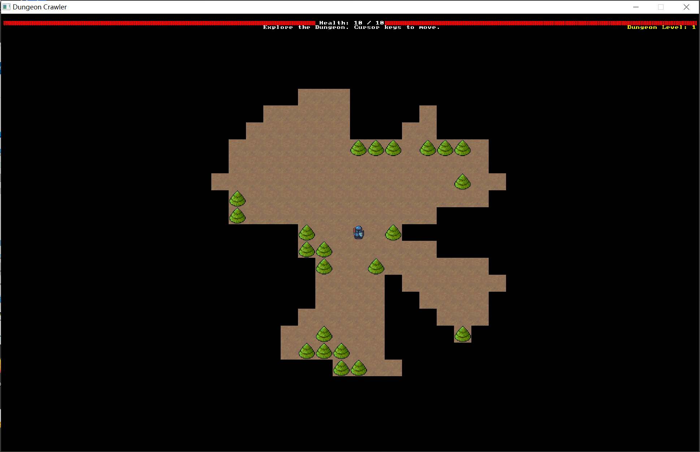
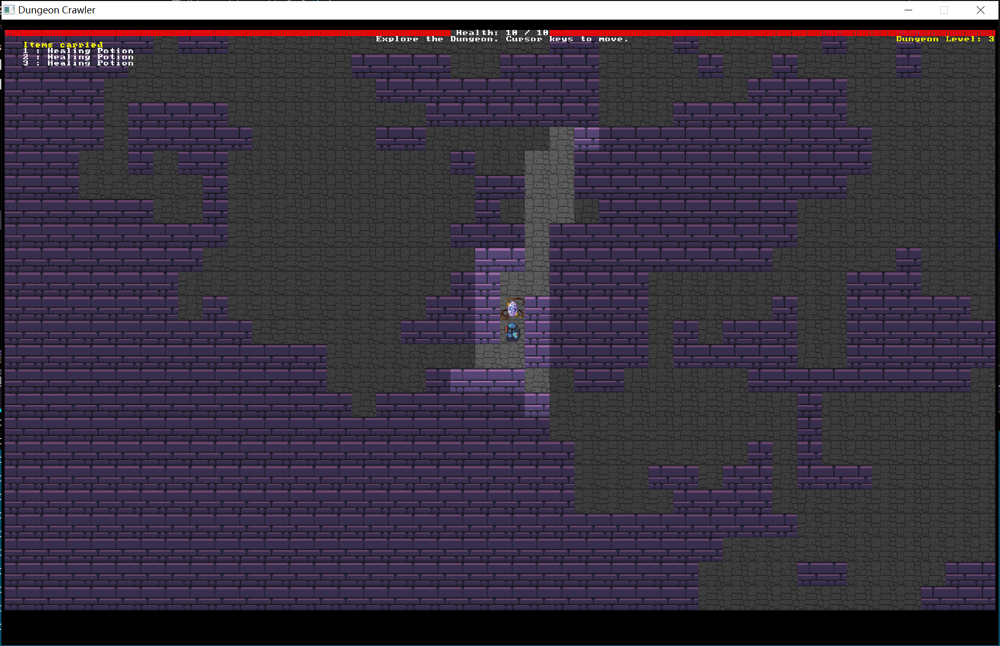

# 《Rust游戏开发实战》书籍阅读与代码实战

&emsp;&emsp;本书通过使用Rust语言基于`bracket-lib`框架实现了一个地下城探险类游戏，介绍了Rust语言的基础语法知识，并且本书的附录B还介绍了游戏设计的一些技巧。

原书项目地址：https://github.com/thebracket/HandsOnRust

## 项目结构

<pre>
resources---------------------------------项目资源
src---------------------------------------学习笔记
+---map_builder-------------------------------地图构建（基于各种构建算法）
+---spawner-----------------------------------模板读取与渲染
+---systems-----------------------------------子系统功能
+---main.rs-----------------------------------主函数入口
+---camera.rs---------------------------------摄像机（游戏视界）
+---components.rs-----------------------------组件
+---map.rs------------------------------------地图组件
+---turn_state.rs-----------------------------游戏模态
Cargo.toml--------------------------------项目依赖包
</pre>

## 游戏说明

1. 角色行走方向：上下左右键
2. 捡物品（治疗药品、地图、武器）：G键
3. 使用物品：数字键1~9

## 运行环境

Rust：rustc 1.81.0 (eeb90cda1 2024-09-04)

## 编译打包

1. 清理编译缓存
```shell
cargo clean
```

2. 重新编译项目
```shell
cargo build --release
```

3. 复制文件并打包
将`target/release/dungeoncrawl.exe`文件和`resources`文件夹复制到一个新文件夹下，完成压缩打包。

4. 使用`Inno Setup Compiler`软件打包
参考网址：https://blog.csdn.net/Java_ZZZZZ/article/details/134327327

## 游戏运行界面



